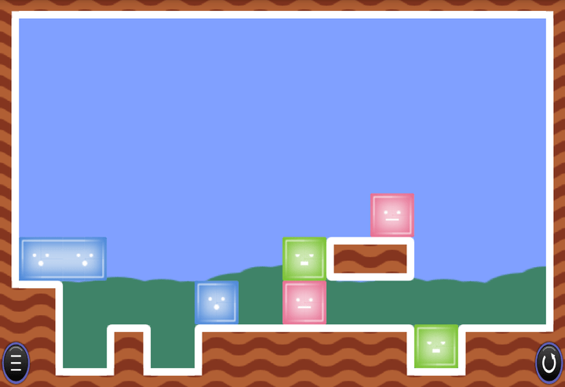

ゼリーのパズルソルバー
======================

[ゼリーのパズル](http://qrostar.skr.jp/index.cgi?page=jelly)ソルバー



#### Ruby

```
$ cd ruby
$ ruby main.rb ../stagedata/001.txt
Solved!
##############
#............#
#............#
#............#
#............#
#........R...#
#BB....G##...#
##...B.R.....#
##.#.#####G###
##############
[1, 6, 1]
##############
#............#
#............#
#............#
#............#
#........R...#
#......G##...#
##BB.B.R.....#
##.#.#####G###
##############
[2, 7, 1]
##############
#............#
#............#
#............#
#............#
#........R...#
#......G##...#
##.BBB.R.....#
##.#.#####G###
##############
[7, 7, 1]
##############
#............#
#............#
#............#
#............#
#........R...#
#.......##...#
##.BBB.GR....#
##.#.#####G###
##############
[7, 7, 1]
##############
#............#
#............#
#............#
#............#
#........R...#
#.......##...#
##.BBB..GR...#
##.#.#####G###
##############
[9, 5, 1]
##############
#............#
#............#
#............#
#............#
#............#
#.......##...#
##.BBB..GRR..#
##.#.#####G###
##############
[8, 7, 1]
##############
#............#
#............#
#............#
#............#
#............#
#.......##...#
##.BBB...GRR.#
##.#.#####G###
##############
[9, 7, 1]
##############
#............#
#............#
#............#
#............#
#............#
#.......##...#
##.BBB....GRR#
##.#.#####G###
##############
Steps=7, check=43, elapsed=0.009s
```


## リンク

  * 解説ブログ記事：[「ゼリーのパズル」ソルバーを作る（A＊）](https://tyfkda.github.io/blog/2025/01/13/jelly-solver.html)
  * [Rubyで優先度付きキューを実装した](https://gengogo5.com/posts/33) ACした優先度付きキュー`PriorityQueue`を使わせていただきました
