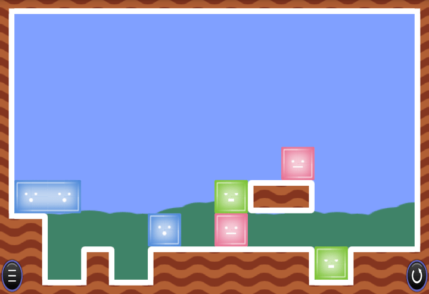
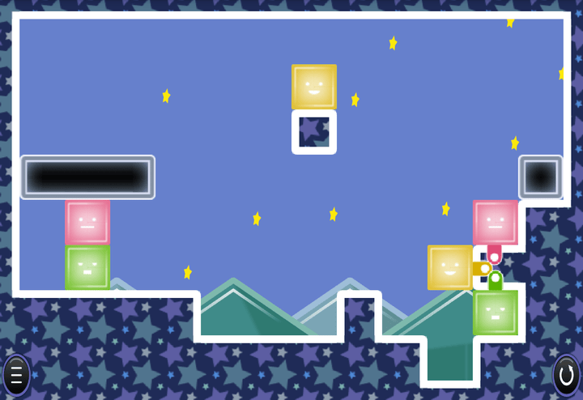
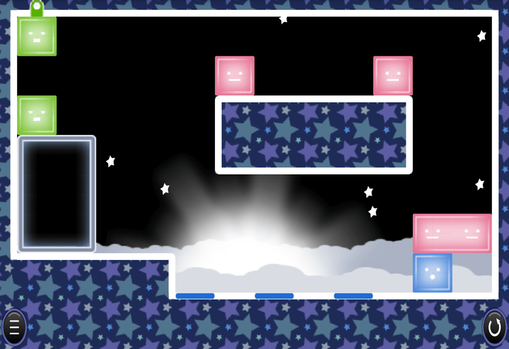

## ステージ紹介

※[Android版](https://play.google.com/store/apps/details?id=com.jellycrew.jellynopuzzle&hl=ja)

#### ステージ1
 
操作に慣れるためのステージ

#### ステージ2
 
赤と青はどうやっても入れ替えられず、穴にハマってる青は動かせないのでクリアの形は…

#### ステージ3
 
青を上を渡す

#### ステージ4
 
黄色を渡すことを考える

#### ステージ5
 
横につなげれば穴を乗り越えられるし上に乗せて運ぶことができる

#### ステージ6
 
縦を作れば渡せる

#### ステージ7
 
赤をくっつけないようにつっかえを残しておく

#### ステージ8
 
青を渡すには縦に3段必要

#### ステージ9
 
赤を縦につなげてしまうと左に持っていけなくなる

#### ステージ10
 
階段状にすれば運べる

#### ステージ11
 
黒ブロックは横幅2なので、1個ずつしか運べない

#### ステージ12
 
どこまで落としても大丈夫か見極める

#### ステージ13
 
赤を落とさないことと、黄色より緑を先に運ぶことを考える

#### ステージ14
 
赤を鍵形にしたい

#### ステージ15
 
赤を落とさないよう黄色を活用

#### ステージ16
 
赤→黄→青の順に揃える

#### ステージ17
 
緑を持っていくには黒ブロックの用法は限られる

#### ステージ18
 
黒ブロックにつながれた黄色ゼリーは下の黄色とくっついてしまうので、すべてをつなげるには下に入れるしかない

#### ステージ19
 
黒ブロックにつながった緑同士を縦につなげれば高さ4で運べる

#### ステージ20
 
下の色を入れ替えるには…

#### ステージ21
 
横に抜いてやる

#### ステージ22
 
下の隙間に逃がす

#### ステージ23
 
青を迎えに行く形に、足を追加して

#### ステージ24
 
青が穴を渡るためには縦3つと横2つが必要

#### ステージ25
 
テトリスでうまく道を作る、四角は落とさない

#### ステージ26
 
エレベータとしては使わない

#### ステージ27
 
全部は穴に埋められず、1つは避ける必要がある

#### ステージ28
 
左右のそれぞれで上下を入れ替える

#### ステージ29
 
最後は緑で支えて青をつなげる

#### ステージ30
 
赤で持ち上げたあと、青をどうやって渡すか…

#### ステージ31
 
上に伸びるので青は1段落としてもよい

#### ステージ32
 
緑を持ち上げれば

#### ステージ33
 
左上にある2つは上下入れ替えてつなげる

#### ステージ34
 
横3の穴を渡るには黄色をどういう形にすべきか…

#### ステージ35
 
伸びるスペースがなければ伸びないことを利用する

#### ステージ36
 
どうにかして黒を隙間に逃がす

#### ステージ37
 
2回持ち上げる

#### ステージ38
 
下の2つを入れ替えるには鍵形を作って持ち上げて下を通す

#### ステージ39
 
真ん中のどちらかをつなげてもう一方は落とす

#### ステージ40
 
これはボーナスステージ

#### ステージ41
 
赤は一通り、左右対称じゃないように解く

#### ステージ42
 
案外ガチャガチャやってればクリアできる？

#### ステージ43
 
左下以外を下に落とす

#### ステージ44
 
横につなげて大きな橋を作る

#### ステージ45
 
案外素直？

#### ステージ46
 
最初は順番通り落として縦積みしてよい、赤を取り出すためには持ち上げないといけない

#### ステージ47
 
まず横に長い赤を作って黄色を渡す

#### ステージ48
 
最初の穴は埋めないで、下の穴は埋める

#### ステージ49
 
上の黒ブロックは最初に落としてOK、最後には横2を押し上げてスペースを作る

#### ステージ50
 
これは手数が多いしやたら難しい（オリジナルの最終面）。
最初に黄色横2を作るために持ち上がらないようにつっかえを置き、赤を運んで持ち上げ、黄色を救出、
棚に置いておいて、固定された赤につなげて、黄色の横幅を伸ばし右の残りを運べるようにする。

#### ステージ51
 
左上の赤は動かないので、そこにつなげられるのは限られる

#### ステージ52
 
緑をつなげるには間に挟む必要がある

#### ステージ53
 
一段低くなったので、黒を避ければよい

#### ステージ54
 
最後にちょっと工夫する

#### ステージ55
 
黄色と緑を入れ替える方法

#### ステージ56
 
黄色を伸ばしすぎないように

#### ステージ57
 
下に埋め込まれた赤を伸ばさないようにするが、緑を縦にはつなげない

#### ステージ58
 
黒ブロックごと持ち上げて運べるようにする

#### ステージ59
 
左の青を持ってくるには穴を赤1マスで埋める必要がある

#### ステージ60
 
赤を運ぶために緑を利用する

#### ステージ61
 
腕を青で、足を赤で持ち上げる

#### ステージ62
 
階段をくっつけずに動かす方法を見つける

#### ステージ63
 
溝にハマった赤を引き上げるにはやっぱ鍵形、くっつく位置調整のためいったん持ち上がらないようにする

#### ステージ64
 
青ゼリーの長さが違うためステージ63とはちょっと違う対処が必要

#### ステージ65
 
赤を直前まで運び、黄色を取り出せるようにする

#### ステージ66
 
ステージ48改、押し上げるには真下から、でなくても今度はできる

#### ステージ67
 
やっぱり鍵形

#### ステージ68
 
黄色を左に運ぶために、赤縦2の上に青横2を乗せる必要がある

#### ステージ69
 
左下の隙間に逃がす必要がある

#### ステージ70
 
ステージ69と同じようには解けないようにできている、窪みに出っ張りがないのがミソ
